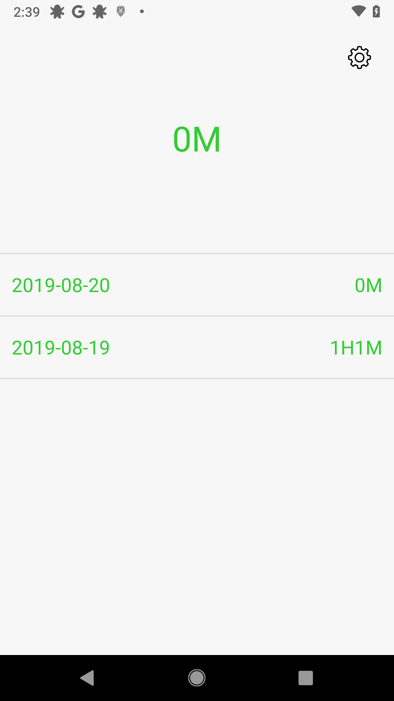
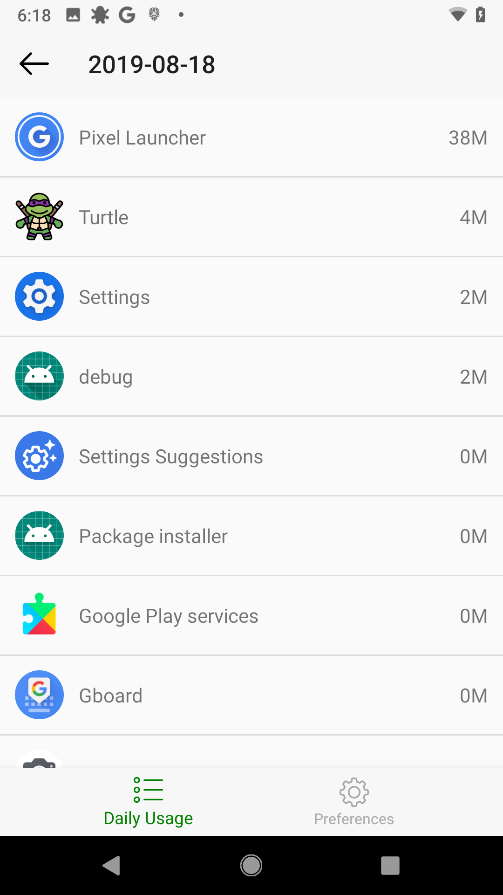
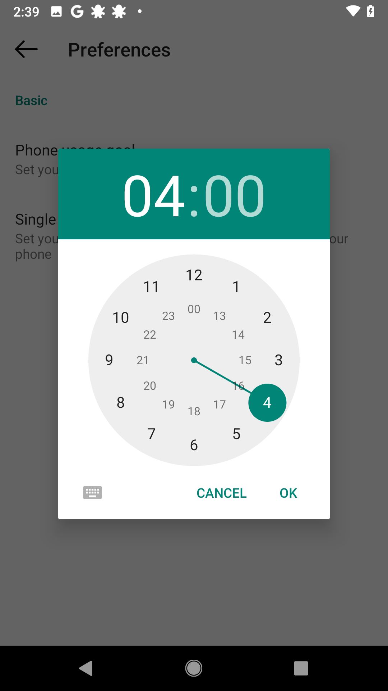

# Turtle

Turtle is an Android app used to track user's usage on their mobile phones.  

## Behind this project

Last year, I found myself addicted to my mobile phone. I used my phone to surf on Facebook, Wechat, Instagram and it distracted me from my work, life, on which I should give more concentration.  

Then I found a APP called **Moment**. It is available on both Android and iOS. Unfortunately, the performance of Moment is so bad on Android platform and it is totally not useful to track my usage on mobile phones.  

So that's why I created Turtle. I use "Turtle" as the name because I want to slow down my life pace and put more forcus on the beauties of this world. I want this app to help me living a healithier life.

## Current States

- 2019.8.20 Version 1.0.1 released, we add preference to this app to enable users to change their limits on phone usage and single app usage. Also we fixed a bug of data mismatch issue.

- 2019.8.18 Version 1.0.0 released, with app usage tracking and overall daily usage tracking, it is a highly useful tool for us to track our usage on mobile phones.  

## How to contribute

- Feedback: All advices for this project is welcome!! Just post an issue on Github.
- Localization: Please clone this project and add your localization strings in //app/src/main/res/value
- Fix bug: Clone this Application to your PC and open it with Android studio. Please open a private branch and send a PR to the master branch.

## Screenshots

Main frame</image>
App usage</image>
Preference</image>

